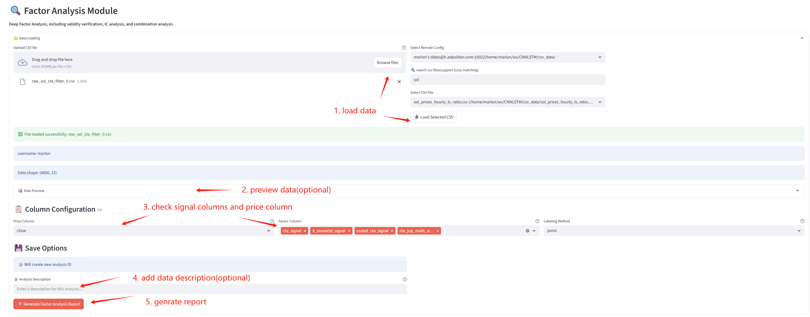
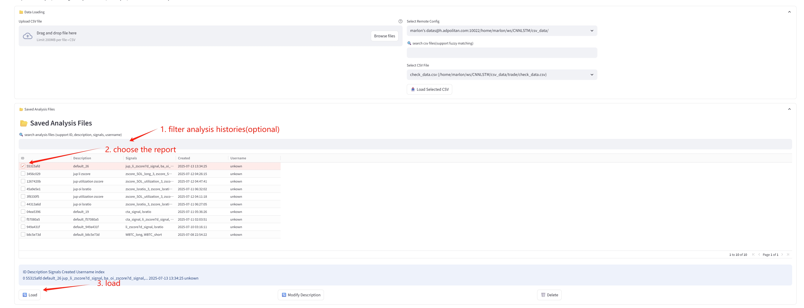
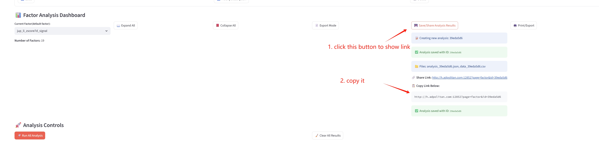
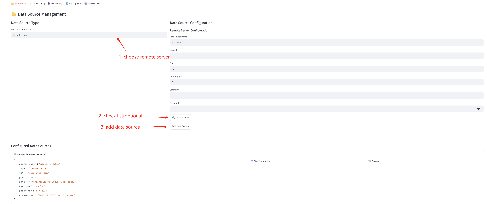

# Usage Guide

---

## Table of Contents

- [Login](#login)
- [Factor Analysis](#factor-analysis)
- [Data Management](#data-management)
<!-- - [Strategy Backtesting](#strategy-backtesting) -->
<!-- - [Result Management](#result-management) -->
<!-- - [Tips & FAQ](#tips--faq) -->

---

## Login

- **Username:** Enter any name to identify your session.
- **Password:** Use the unified password provided by the administrator.

## Modules Overview

The platform consists of four main modules:

## Factor Analysis

1. Load and preprocess factor data
    - load csv file
    - use remote server's datas (add new data source in [Data Management](#data-management))
2. preview data(optional)
3. choose the signal columns
4. Generate analysis reports
5. You can share the report with others by link, or you can load any report from the server.

## Data Management
1. Now only support remote ssh data source.

<!--
### 3. Strategy Backtesting
- Build and configure trading strategies
- Run historical backtests
- Analyze backtest results and risk metrics
- Generate backtest reports

### 4. Result Management
- Manage and view result reports
- Visualize results with interactive charts
- Export results for further analysis
- Compare historical results -->

<!-- ## Tips & FAQ
- **Navigation:** Use the sidebar or footer to switch between modules.
- **Saving Work:** Reports and results are saved automatically in your session.
- **Printing:** The platform is optimized for printing reports and charts.
- **Help:** If you encounter issues, contact the administrator or check for updates. -->

## TODO
- [ ] export mode not working well~

---

Enjoy exploring the Quantitative Backtesting Platform!
